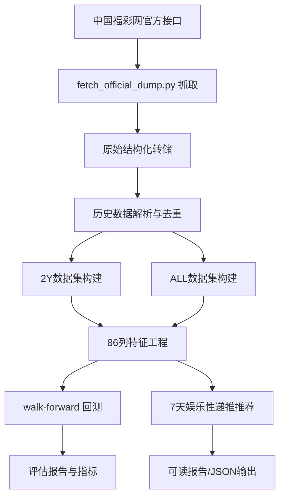

# fucai3d-research

[](./LICENSE)
[](https://github.com/mmwei258/fucai3d-research)
[](https://github.com/mmwei258/fucai3d-research/commits/main)
[](https://github.com/mmwei258/fucai3d-research)

> 中国福利彩票 3D（福彩3D）历史数据工程、特征构建、walk-forward 回测、娱乐性推荐与 skill 封装项目。

---

## ⚠️ 重要声明（请先阅读）

本仓库仅用于：
- 数据工程实践
- 统计分析与回测方法展示
- 教育与研究归档

**不构成任何投注建议、投资建议或收益承诺。**

彩票具备显著随机性与长期负期望特征，任何推荐/模拟/排序都仅供娱乐参考。请理性娱乐，量力而行，远离沉迷。  
更多说明见 [`docs/DISCLAIMER.md`](./docs/DISCLAIMER.md)。

---

## 项目快照（Snapshot）

| 维度 | 数值 |
|---|---:|
| 官方接口全历史记录数 | **4750** |
| 全历史区间 | **2013-01-02 ~ 2026-09-12** |
| 两年样本记录数 | **703** |
| 特征列数 | **86** |
| 回测方式 | Walk-forward（样本外） |
| 测试集大小 | 500 期 |
| 最优参数 | window=180, half_life=180（由验证集网格搜索选出，预测脚本自动继承） |

---

## 回测核心结果（样本外）

> 测试集：`2025097 ~ 2026245`（500 期，2025-04-17 ~ 2026-09-12）

| 指标 | 结果 | 随机基线 |
|---|---:|---:|
| Exact Top1 | 0.00% | 0.10% |
| Exact Top5 | 0.20% | 0.50% |
| Exact Top10 | 1.00% | 1.00% |
| Exact Top20 | 2.00% | 2.00% |
| Exact Top50 | 4.00% | 5.00% |
| 组选 Top20 | 10.40% | 9.09% |
| 和值 Top3 | 21.40% | 22.30% |
| 跨度 Top3 | 40.00% | 43.80% |
| 组三/组六/豹子 Top1 | 71.60% | 72.00% |

**理性结论：** 在严格样本外测试下，精确命中各项均未超过随机基线（Top50 反而低于基线），
结构类指标（和值/跨度/组态）同样不优于"盲猜最可能的取值"。**本项目未显示任何可利用的预测优势。**

> 注：随机基线为精确值，非估算——TopN 即 N/1000；和值/跨度/组态取"命中率最高的 3 个（或 1 个）取值"
> 在 000~999 全组合上的理论覆盖比例。

---

## 数据资产（Data Assets）

### 1) 两年数据集（`data/2y/`）
- 区间：`2024-09-12 ~ 2026-09-12`（滚动近两年）
- 期号范围：`2024246 ~ 2026245`
- 记录数：`703`

| 文件 | 说明 |
|---|---|
| [`history_official_2y_full.json`](./data/2y/history_official_2y_full.json) | 两年全字段历史 |
| [`history_official_2y_features.json`](./data/2y/history_official_2y_features.json) | 两年特征（JSON） |
| [`history_official_2y_features.csv`](./data/2y/history_official_2y_features.csv) | 两年特征（CSV） |
| [`history_official_2y_summary.json`](./data/2y/history_official_2y_summary.json) | 两年数据摘要 |

### 2) 全历史数据集（`data/all/`）
- 当前官方接口实际可得：`2013-01-02 ~ 2026-09-12`
- 期号范围：`2013002 ~ 2026245`
- 记录数：`4750`

| 文件 | 说明 |
|---|---|
| [`history_official_all_full.json`](./data/all/history_official_all_full.json) | 全历史全字段 |
| [`history_official_all_features.json`](./data/all/history_official_all_features.json) | 全历史特征（JSON） |
| [`history_official_all_features.csv`](./data/all/history_official_all_features.csv) | 全历史特征（CSV） |
| [`history_official_all_train.json`](./data/all/history_official_all_train.json) | 训练输入历史 |
| [`history_official_all_summary.json`](./data/all/history_official_all_summary.json) | 全历史数据摘要 |

### 3) 原始抓取转储（`data/raw/`）
官方接口返回的原始转储（格式与 browser 会话导出一致，可被构建脚本直接解析）：
- [`official_api_2y_browser_dump.txt`](./data/raw/official_api_2y_browser_dump.txt)
- [`official_api_all_browser_dump.txt`](./data/raw/official_api_all_browser_dump.txt)
- [`fetch_config_2y.json`](./data/raw/fetch_config_2y.json)

刷新方式（需联网，会覆盖上面两个 dump；写盘前会用解析器自检，失败则拒绝写入）：

```bash
python3 scripts/fetch_official_dump.py             # 更新 all + 2y
python3 scripts/fetch_official_dump.py --mode all  # 只更新全历史
python3 scripts/fetch_official_dump.py --dry-run   # 只抓取与自检，不写文件
```

---

## 报告与输出（Reports）

| 文件 | 说明 |
|---|---|
| [`backtest_walkforward_report.md`](./reports/backtest_walkforward_report.md) | 回测结论摘要 |
| [`backtest_walkforward_summary.json`](./reports/backtest_walkforward_summary.json) | 回测完整指标 |
| [`backtest_latest500_predictions.jsonl`](./reports/backtest_latest500_predictions.jsonl) | 最近500期预测样本 |
| [`forecast_next7days_entertainment.md`](./reports/forecast_next7days_entertainment.md) | 未来7天娱乐推荐 |
| [`forecast_next7days_entertainment.json`](./reports/forecast_next7days_entertainment.json) | 7天推荐结构化结果 |

---

## 方法流程（Method Pipeline）



---

## 快速开始（Quick Start）

> 环境：Python 3（脚本主要使用标准库）

```bash
# 0) 刷新官方数据转储（可选；联网更新 data/raw/，再用后续步骤重建派生数据）
python3 scripts/fetch_official_dump.py

# 1) 两年数据构建
python3 scripts/build_fucai3d_dataset.py

# 2) 全历史数据构建
python3 scripts/build_fucai3d_all_dataset.py

# 3) walk-forward 回测（选出 window / half_life）
python3 scripts/fucai3d_backtest_walkforward.py

# 4) 未来7天娱乐推荐（自动继承第 3 步选出的参数）
python3 scripts/fucai3d_forecast_next7days.py
```

Windows 下也可直接双击仓库根目录的 [`一键运行.bat`](./一键运行.bat) 依次执行上述第 1~4 步。

> 顺序有依赖：第 4 步从第 3 步的报告中读取 `selected_config`，请勿跳过回测直接跑预测。

---

## 目录结构

```text
fucai3d-research/
├── data/
│   ├── raw/       # browser 抓取原始转储
│   ├── 2y/        # 两年数据/特征/摘要
│   └── all/       # 全历史数据/特征/摘要
├── reports/       # 回测结果与推荐输出
├── scripts/       # 抓取、构建、回测、推荐脚本
├── skill/         # Minis skill 封装
├── docs/          # 免责声明等文档
├── LICENSE
└── README.md
```

---

## Skill 集成

仓库内包含 minis skill：
- [`skill/fucai3d-latest/SKILL.md`](./skill/fucai3d-latest/SKILL.md)

配套本地推荐器：
- [`scripts/recommender.py`](./scripts/recommender.py)

---

## 风险与解释边界

- 回测不是未来保证。
- 结构指标命中高于精确号码命中并不等于可稳定盈利。
- 切勿将本项目任何结果用于“必胜”叙事。
- 若仅用于娱乐，请严格设置预算上限与止损边界。

---

## 致谢

- 数据来源：中国福彩网公开接口（以抓取时返回结果为准）
- 项目定位：个人研究归档与工程实践

---

## License

[MIT](./LICENSE)
